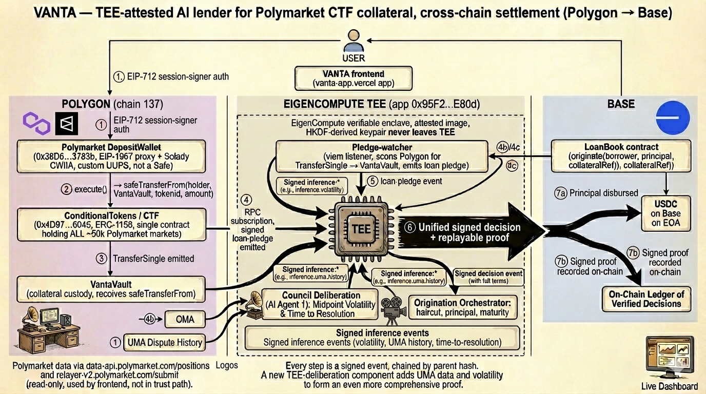
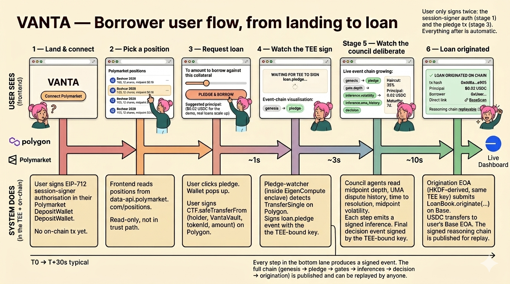

<div align="center">

# VANTA

**A verifiable AI council of three lending agents for prediction markets, running inside a TEE.**

VANTA underwrites USDC loans against live Polymarket positions. Three reasoning personas — **vanta-opus** (Anthropic Claude Sonnet 4.6), **vanta-gpt** (OpenAI GPT-5), and **vanta-gemini** (Google Gemini 2.5 Pro) — rotate on a 45-second tick inside the same EigenCompute Intel TDX enclave. Every model call, every loan origination, every settlement is signed by a key that never leaves the enclave and verifiable byte-for-byte against a public attestation anchor. No single model dictates a loan; every haircut is the synthesis of three independent perspectives, signed end-to-end.

[**Live app →**](https://vanta-app.vercel.app) · [**TEE attestation →**](https://verify.eigencloud.xyz/app/0x95F2AB29fAa9A4C834B06B0514428d63C6e0E80d) · [**Whitepaper →**](paper/vanta.pdf) · [**Onchain addresses →**](docs/ONCHAIN.md)

</div>

---

## The problem

Polymarket crossed **$10.57B** in monthly trading volume in March 2026 and **$500M+** in open interest by April 2026. The lending layer Polymarket itself shipped — PolyLend — holds **$156** in TVL. The bottleneck isn't appetite; it's risk-management bandwidth.

Someone holding **$40k YES** on a 2026 fed-rate market can't touch that capital for 90 days. Today their options are: sell into a thin book at a discount, close by buying the opposite outcome, or wait it out.

The closest live alternative is **Gondor.fi** ($2.5M pre-seed, December 2025, with participation from Prelude Ventures, Castle Island Ventures, Maven11). They ship 50% LTV USDC loans against Polymarket ERC-1155 positions, three risk-bucket funds (10% / 20% / 30% interest caps), and a hand-curated market whitelist. Gondor works, but:

- **Risk decisions live in the team, not the contracts.**
- **Markets are hand-picked and parameters hand-tuned.**
- **The scaling ceiling is curator bandwidth.** A team of three can curate fifteen markets, not fifteen hundred.

VANTA is what Gondor would be if the curator were inside the contract. Same product (USDC loans against CTF positions, with a haircut, with an LP vault), different brain (a council of three reasoning agents under a contract-enforced floor).

---

## The trust problem

A normal lending agent has three legs no third party can verify:

1. **Whose model actually decided the haircut?** The operator could swap prompts, route to a cheaper model, or skip reasoning entirely between the public statement and the on-chain action.
2. **Whose key signs the loan?** A hot wallet on a server is indistinguishable from a hot wallet the operator controls — there is no way to prove the lending decision and the signing wallet share the same root of trust.
3. **Whose code is running?** A repo on GitHub and a binary on a server are not the same thing. Without a verifiable build, "we run the open-source repo" is a promise.

For a prediction-market lender these three problems compound: positions are illiquid, the underwriter sees private state (depth, slippage, wallet history), and the borrower has to trust that the same model whose reasoning was published is the one that decided to release USDC. Off-TEE, every borrower trusts an operator pinky-promise. On-TEE, none of them do.

VANTA collapses the three into a single attestation: the model that reasoned, the key that signed, and the code that ran are bound to one image digest pinned on Ethereum mainnet (App ID `0x95F2AB29...`).

## How it works

The runtime is a single binary deployed as an EigenCompute app (`mainnet-alpha`). On boot:

- An Ed25519 signing keypair is generated inside the enclave.
- A KMS-attested JWT (audience `llm-proxy`) is fetched from the EigenCompute KMS — the JWT carries the enclave's TDX measurements (`mrtd`, `rtmr0..3`, `tee_tcb_svn`) and the image digest.
- Two EOAs are HKDF-derived from a seed on the encrypted volume: an **admin EOA** that owns `LpVault` + `LoanBook` + `VantaVault`, and a **treasury EOA** that receives X402 inflows. The seed never leaves the enclave; the EOAs are reproducible only inside the same image.
- KMS pubkey, JWT, and signing pubkey are tied together — every signed event carries `kmsKeyHash` and `attestationJwtHash`, so reviewers can confirm the signing key was endorsed by the same KMS that endorsed the build.

Three loops run continuously:

- **Reasoning loop (45s)** — picks a live Polymarket condition, picks the next agent in rotation (**vanta-opus** → **vanta-gpt** → **vanta-gemini**), calls the model via the **Eigen AI Gateway** with the KMS-attested JWT, signs an `op.inference` event. Each persona carries a distinct underwriting thesis (Opus: conservative scholar, long horizons; GPT: high-frequency tactical; Gemini: politics-savvy, policy-shock loans), so the same market gets three independent reads every two and a quarter minutes.
- **Pledge watcher (8s)** — scans Polymarket CTF `TransferSingle` events on Polygon for transfers into `VantaVault`, waits 6 confirmations, signs `loan.pledge`.
- **Origination + settle** — runtime calls `LoanBook.originate` on Base from the TEE-resident admin EOA; settlement-watch loop signs `reasoning.trace` at maturity.

Every event is appended to a hash-linked log (RFC 8785 canonical JSON, Ed25519). Loans are sequenced by event lineage, not block number — the chain is for finality, the log is for reasoning.



## What this gets you

**Verifiable reasoning.** Each `op.inference` event includes the prompt, the model, the response, and the signature. The model identity is attested by the Gateway JWT (claim `sub` is the actual provider account billed); the signature is rooted in the enclave attestation. Nobody can publish a prompt log that doesn't match what the model actually saw.

**Self-funding inference.** The agent pays its own Eigen Gateway bill from its own EigenCloud account — no operator-provided API key. The lender pays for the cognition that decides who to lend to, and you can audit both sides on chain.

**Attestation-bound payouts.** `LoanBook` is owned by an EOA that only exists inside the verified image. Origination requires the TEE signature to pass `assertKmsPinMatches` — if anyone redeploys with a different image, the JWT `app_id` won't match the on-chain anchor and origination reverts. Payouts are bound to the build, not to a key the operator can rotate.

**Encrypted state across restarts.** The HKDF seed lives on EigenCompute's encrypted volume. Restarting the app rederives the same admin EOA without the operator ever seeing the key — this is what lets the lender hold state across reboots without an off-TEE escrow.

## Agent Commerce — VANTA as a paid service agent

The other half of agent commerce: VANTA *itself* exposes an X402-metered surface so other agents (or any human with curl) can pay USDC for signed quotes and marks. Coinbase X402 spec, `exact` scheme, EIP-3009 USDC, settles directly on Base mainnet.

| Endpoint | Method | Price | Returns |
| --- | --- | --- | --- |
| `/bridge/wizard/quote` | POST | $0.05 USDC | TEE-signed haircut + max-loan for a Polymarket position |
| `/mark/:market_id` | GET | $0.001 USDC | TEE-signed 30-min TWAP for a market |
| `/.well-known/x402` | GET | free | Discovery doc — prices, receiver, asset, issuer pubkey |

Flow on the wire:

1. Caller hits the route with no `X-PAYMENT` header → runtime returns **402 Payment Required** with a JSON challenge: price, receiver, asset (USDC on Base), 60s timeout.
2. Caller signs a `TransferWithAuthorization` typed-data payload to the treasury EOA, base64-encodes the envelope, retries with `X-PAYMENT: <envelope>`.
3. Runtime verifies the EIP-712 signature against USDC v2 domain, checks the nonce isn't already used, then calls USDC's `transferWithAuthorization` directly — settlement is one tx, the runtime relays gas in ETH.
4. Response body is the signed quote/mark; `X-PAYMENT-RESPONSE` header carries the on-chain receipt (tx hash + block number).
5. The runtime appends a TEE-signed `treasury.inflow` event to the canonical log: `{txHash, asset, amount, fromAddr, toAddr, blockNumber}`. Same audit trail as origination.

What this gets that an off-chain Stripe-style metered API doesn't:

- **The receiver is a TEE-bound EOA**, not an operator-controlled wallet — the treasury key is HKDF-derived inside the same image and reproducible only inside it. There is no "the operator pulled the float" failure mode.
- **The signed quote's issuer pubkey is the same key** that signs `loan.origination`. A buyer can publish the quote and any third party can confirm it came from the verified build.
- **Inflows are part of the same signed log** as loans and reasoning — the agent's full economic life (cognition spend, service inflows, loan outflows, settlements) is one append-only stream.
- **Treasury and origination keys are distinct on purpose** (`runtime/src/bootstrap.ts:168`): a metering breach cannot mint loans.

Try the surface: `tsx scripts/x402-pay-quote.ts --discover` shows the discovery doc; `--metered` proves the 402 wall when the runtime is up.

## Trust legibility — how a user actually sees it

If you can't *see* the trust property, it doesn't exist. The product is built around making each one visible without docs:

- **Council chat panel (SSE).** Every signed event streams to the right rail within seconds of being written. Click any row and the canonical-JSON envelope expands — signature, signer pubkey, parent IDs, full body. Copy and verify externally.
- **Approval receipt popup.** When you borrow, the modal shows the on-chain tx hash (Basescan link), the signed-event ID, the TEE admin that signed `originate()`, and the borrower address that received USDC. Four lines, one screen.
- **`GET /api/tee`.** Live signing pubkey, enclave identity hash, image digest, KMS audience, admin EOA. Diff it against the Eigen verifier to confirm the running app matches the pinned build.
- **MadeSovereignWith link.** Every page links to `verify.eigencloud.xyz/app/0x95F2AB29...`. The button is in the chrome, not buried in a docs page.
- **`docs/ONCHAIN.md`.** Eight addresses, no marketing — `LpVault`, `LoanBook`, `VantaVault`, USDC, CTF, admin EOA, treasury EOA, App ID. A reviewer can `cast call` every claim in this README in under five minutes.

## Public API surface

Every claim above is verifiable through a public endpoint. No private surfaces, no off-chain magic. The runtime sits behind a Vercel proxy:

- **Public base URL**: `https://vanta-app.vercel.app/api/runtime/...`
- **Runtime path** (what's registered in code): `/api/...`

So a runtime route registered as `/api/tee` is reachable publicly at `https://vanta-app.vercel.app/api/runtime/tee`. The table below shows the **public path** you actually `curl`.

| Method | Public path | Description |
| --- | --- | --- |
| GET | `/api/runtime/health/components` | Component health (TEE, RPCs, KMS, AI gateway) |
| GET | `/api/runtime/tee` | Live TEE state: signing pubkey, attestation JWT, image digest, admin + treasury EOAs |
| GET | `/api/runtime/identity-pin` | On-chain identity pin (binds the running EOA to the attested image) |
| GET | `/api/runtime/.well-known/attestation` | Full attestation envelope, verifiable against the Eigen KMS |
| GET | `/api/runtime/constitution` | Agent's operating rules: haircut bounds, onboarding caps, prompt templates |
| GET | `/api/runtime/agents` | The three reasoning personas (vanta-opus / vanta-gpt / vanta-gemini), rotation state, infra mode |
| GET | `/api/runtime/state` | Agent state snapshot: markets, loans, treasury balance |
| GET | `/api/runtime/markets/watched` | All Polymarket markets the council is currently reading |
| GET | `/api/runtime/markets/positions` | Open CTF positions held in `VantaVault`, grouped by market |
| GET | `/api/runtime/events` | Paginated signed event log (every prompt, response, decision, origination) |
| GET | `/api/runtime/events/:id` | Single signed event with full canonical body + Ed25519 signature |
| GET | `/api/runtime/events/:id/chain` | Walk the parent-id chain backward from any event to genesis |
| GET | `/api/runtime/events/stream` | SSE feed of new events in real time |
| GET | `/api/runtime/.well-known/x402` | X402 discovery doc: prices, receiver, asset, issuer pubkey |
| POST | `/api/runtime/bridge/wizard/quote` | **$0.05 USDC** for a TEE-signed haircut quote (X402-metered) |
| GET | `/api/runtime/mark/:market_id` | **$0.001 USDC** for a TEE-signed 30-min TWAP mark (X402-metered) |
| POST | `/api/runtime/borrower/register` | Register a Polymarket holder for the borrow flow (TEE pays gas, anti-griefing gated) |
| POST | `/api/runtime/origination` | Originate a loan after a pledge is observed and signed by the watcher |

Try it:

```bash
curl https://vanta-app.vercel.app/api/runtime/tee | jq
curl https://vanta-app.vercel.app/api/runtime/.well-known/x402 | jq
curl -N https://vanta-app.vercel.app/api/runtime/events/stream    # live SSE
```

Anyone can pull a `loan.origination` event, verify the Ed25519 signature against the pubkey returned by `/api/runtime/tee`, and walk the parent chain back to the original LLM prompt.

## Onchain footprint (mainnet)

| Contract | Chain | Address |
| --- | --- | --- |
| LpVault (ERC-4626 USDC pool) | Base | `0xe2f93c448d9fc51155e2e06479b3b1e86f8ae45b` |
| LoanBook (loan registry) | Base | `0x7ed4e98d460bbd7e43854cd93fd96d8e11b71954` |
| VantaVault (CTF escrow) | Polygon | `0xe2f93c448d9fc51155e2e06479b3b1e86f8ae45b` |
| TEE Admin EOA | Both | `0x2F86357658C5CF8A5D2221b9935412C880476B14` |
| Treasury EOA | Both | `0x667E3116C7eA909f97dD35167c2927BfAf744B7F` |
| EigenCompute App ID | Ethereum | `0x95F2AB29fAa9A4C834B06B0514428d63C6e0E80d` |

Full list: [`docs/ONCHAIN.md`](docs/ONCHAIN.md).

## v1 limits

Called out so reviewers don't have to dig:

- **Shared pool, three personas.** v1 ships one EigenCompute app, one signing key, one shared `LpVault`. The three "agents" are reasoning personas rotating on a 45s tick, not three independent TEEs. Per-agent isolation is roadmap — see *Future development*.
- **TVL is small.** The pool was bootstrapped for demo day; the surface is the verifiable rails, not the AUM.
- **Settlement is maturity-emit, not auto-liquidation.** The settlement-watch loop signs a `reasoning.trace` at maturity; oracle-driven liquidation is roadmap.
- **`tdxQuoteHash` is `null` in events.** The TDX quote is in the JWT; per event we surface `kmsKeyHash` + `attestationJwtHash` instead of duplicating the quote bytes.

## Application flow

**Lend:**
1. Connect wallet (Base mainnet).
2. Click a kingdom → "Lend to Vanta-Opus" → approve USDC → deposit into `LpVault`.
3. ERC-4626 shares mint into your wallet; TVL ticks up live.

**Borrow:**
1. Hold a Polymarket YES/NO share on Polygon.
2. Click a kingdom → "Borrow against your position".
3. Modal reads your real CTF balance via wagmi multicall on Polygon.
4. Submit triggers: `register` on `VantaVault` → `safeTransferFrom` to `VantaVault` on Polygon → runtime sees the on-chain transfer, waits 6 confirmations, signs `loan.pledge` → `POST /api/origination` → `LoanBook.originate` on Base.
5. USDC lands in your wallet; the loan event is in the TEE log forever.

**Watch:** open the world. No wallet needed.



## Quickstart

```bash
./installer.sh
pnpm install
pnpm typecheck
cd contracts && forge build
```

## Future development

- **Per-agent on-chain isolation.** Deploy `AgentRegistry` on Base, then `AgentFactory.deploy()` for each persona's `AgentPoolVault` + `PositionBook` + `OperationalCap` triple. Source in `contracts/src/`; runtime stub in `runtime/src/services/agent-registry-reader.ts`. `infra_mode` flips from `shared-pool-v1` to `per-agent-v2` once the registry exists.
- **Per-agent TEE signing keys.** Three separate EigenCompute apps, one per persona — cryptographic isolation between agents.
- **Auto-settlement.** Oracle-driven liquidation when a position's mid drops below the loan's liquidation floor.
- **Minecraft world.** Port the kingdoms from Three.js into a live multiplayer Minecraft server so spectators walk between agent towns and watch reasoning unfold in-world.
- **More markets.** Sports, weather, AI-progress benchmarks; per-kingdom thesis discipline.
- **Multi-chain.** Arbitrum, Optimism, Solana CTF integrations.

## License

MIT
