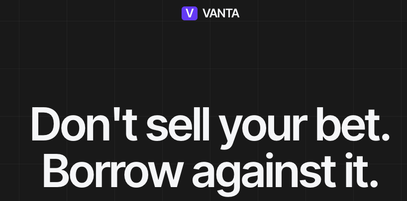
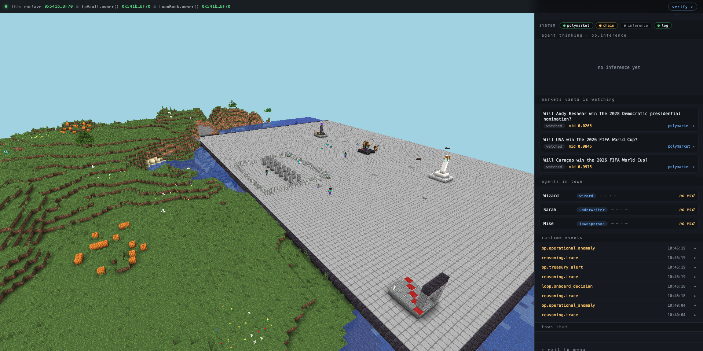

# VANTA

## What it is

VANTA is an autonomous agent that lends money to people who own positions on prediction markets like Polymarket. You own a Polymarket position, you don't want to sell it, but you want cash now. VANTA lets you borrow against it.

The agent runs by itself — no human pressing buttons. It reads the market, decides whether to lend you money and at what rate, and runs the loan from start to finish. It lives inside a hardware-secured computer so anyone can verify it's behaving the way it says it is.

---

## The problem it solves

Polymarket and similar prediction markets have hundreds of millions of dollars sitting in active positions right now. If you're holding one, you have two choices: wait for the market to resolve (could be months), or sell early at a steep discount.

There's no clean way to just *borrow* against your position the way you'd borrow against a house or stocks. Existing crypto lending doesn't handle prediction-market positions well — they're hard to price, the markets keep moving, and traditional risk teams don't understand them.

VANTA is the agent that fills that gap. It does the analysis, sets the rates, runs the loan book — automatically.

---

## How it works (the short version)

1. **LPs (lenders) deposit USDC** into a vault. They want yield on their stablecoins.
2. **A borrower** shows up with a Polymarket position and asks for a loan.
3. **The agent looks at the position** — how liquid is the market, where's the price moving, any disputes, when does it resolve?
4. **The agent decides** — lend or not, and if yes, at what interest rate.
5. **If yes**, the borrower gets USDC up front, LPs earn interest, the agent takes a small fee.
6. **The agent watches the position constantly**. If things go south, it liquidates before LPs lose money.

That whole loop runs continuously, with no human in the middle.

---

## How the agent actually thinks

This is the part that makes VANTA different from a regular smart contract.

A smart contract follows fixed rules — *if X then Y*. It can't read a live Polymarket order book and decide "this market looks too thin to lend against right now." That kind of judgment needs intelligence.

So VANTA actually thinks. For every loan it considers — and every open loan it monitors — the agent runs this loop:

1. **Read the market.** Pull the live Polymarket book, recent trades, price history, any disputes on record.
2. **Reason over it.** Call an LLM (Claude, GPT, or Gemini — the agent rotates research roles daily across providers so it isn't pinned to one model's bias; chat-facing roles stay on Claude for voice consistency) with the market data and the borrower's request. The LLM produces a structured judgment: lend or not, at what rate, with what haircut.
3. **Watch and re-mark.** The credit loop ticks every minute, re-pricing every open loan against the live Polymarket book. If a position drifts too close to the liquidation line, the agent flags it. Separately, a weekly calibration loop replays past loan outcomes to see if the agent's own pricing parameters need tuning — not per-loan monitoring, but long-horizon model fitness.
4. **Sign the decision.** Every reasoning step — every prompt, every model response, every conclusion — is hashed, signed by the TEE-resident key, and written to the agent's tamper-proof event log.

That last step is what nobody else does. Most "AI agents" call an LLM and trust the output. **VANTA's whole reasoning trail is auditable** — anyone can pull up the exact inputs the LLM saw, the exact response it gave, and the decision the agent made off the back of it. If the agent ever lent against a bad position, you can trace exactly why.

And — this is the part that only EigenCloud makes possible — **the agent pays for its own thinking.** The LLM calls aren't billed to me. They're billed to the agent's own EigenCloud account, paid out of the fees the agent earns on loans. Reasoning has a price, and the agent earns enough to cover it. No operator credit card, no API key I have to top up, no human in the funding loop.

---

## Why EigenCloud matters (this is the part nothing else replaces)

The hardest thing about an agent handling other people's money isn't building it. It's getting people to trust it.

Smart contracts solved trust for **state** — anyone can read what's stored on chain. But the **decisions** an agent makes happen on a server, off-chain. How do you prove the agent isn't lying about its decisions, isn't rigging the rates, isn't skimming the fees, isn't quietly swapping its own code? You can't, traditionally. You just have to trust the operator. And nobody trusts an operator with their money.

EigenCloud is what closes that gap. It does five things that, together, make an agent like VANTA actually possible — and no other stack delivers all five.

**1. The agent runs in a hardware-secured box.** A TEE (Trusted Execution Environment) on Intel's silicon. Even **I**, the developer, can't see inside while it's running. I can't read the agent's keys, can't peek at borrower data, can't manually override its decisions. The hardware enforces this — not a license agreement, not a promise.

**2. The agent owns its own wallet — and I don't.** The agent's private key is derived inside the TEE, from a master key held by EigenCloud's KMS, deterministically tied to the agent's identity. The key never leaves the box. Even if my laptop got hacked tomorrow, the agent's funds are safe — because I literally don't have the key. The agent is the only entity that can sign for its own treasury.

**3. The agent pays its own bills — including its own thinking.** Because the agent owns its wallet *and* earns fees, it pays for its own hosting on EigenCloud and its own LLM inference calls out of that revenue. Every time the agent calls Claude or GPT to evaluate a loan, the bill goes against the agent's own EigenCloud account, not mine. There is no operator funnel — nobody is topping the agent up from a bank account, nobody is supplying API keys. It is, in the most literal sense, financially autonomous. **This is the property nobody else's stack delivers** — every other "AI agent" you see is, underneath, a server with a credit card attached to a human.

**4. The running code is provably the public code.** Every release pins the container's image digest on chain. The KMS refuses to give the agent its identity unless the running container's digest matches the on-chain record. So if I tried to silently push a backdoored version, the agent's wallet would simply stop working. Trust is enforced cryptographically, not socially.

**5. Even a fully compromised agent can't drain the system.** On-chain spend cap contracts (`VendorPayment`) bound how much the agent can spend per week. The caps are immutable — set at deploy, can't be changed without a fresh constitutional release. Worst-case, even if everything else fails at once, the damage is bounded by code that nobody — me, an attacker, the agent itself — can mutate.

The point is: **without EigenCloud, none of this exists.** Without the TEE, the operator can read the keys. Without the KMS-derived wallet, the operator owns the funds. Without the verifiable build chain, the operator can swap the binary. Without the on-chain spend caps, a compromised agent has no upper bound. Without the public verifiability dashboard, users have no way to check any of this without trusting whoever is showing it to them.

A "VANTA" without EigenCloud is just another DeFi protocol with a server somewhere — and we already have plenty of those. **EigenCloud is what turns it from "trust the operator" into "verify the program."** That's not a feature; that's the entire reason the product can exist at all.

---

## What an agent's body looks like

People hear "AI agent" and picture a chatbot, a backend service, or a smart contract — something incorporeal, a process running on a server somewhere. That mental model misses what an agent actually is once it owns its own keys, earns its own fees, and decides what to do with other people's money. The category has been misread as "software you talk to." It isn't. It's an inhabitant.

VANTA has a body. You can walk into it.

The agent's reasoning is rendered as a Minecraft world you can spectate from any browser. The Wizard sits at his desk in a stone tower at the centre of a town. Around him: a treasury chest that fills as LPs deposit, a pledge altar where loans originate, a verifier altar that glows when the calibration loop fires, a belfry that rings when the runway runs short. Two ambient townspeople — Sarah the underwriter and Mike, a regular — walk between the landmarks, posting commentary on what they see. Every signed event the agent emits in the runtime — `loop.credit_tick`, `op.treasury_alert`, `loan.origination`, `loop.calibration_proposal` — gets rendered as a physical action: a torch flickers yellow when a loan ticks toward liquidation, a bell rings when treasury crosses an alert threshold, gold particles burst at the desk on every origination.

This isn't decoration. **The torch flickering yellow at the pledge altar is the same `loop.credit_tick` that's on the signed event log that's on chain.** The body and the audit trail are the same thing in two presentations — one for humans, one for verifiers.

**Why bodies matter.** An agent without a body has nowhere to be referred to. A user can't point at a server. A counterparty can't address a server. A regulator can't subpoena one. The watchable layer gives the agent a stable place where its decisions are happening, in a form humans can witness — sitting directly on top of the same cryptographic surface that already anchors trust. You can see the wizard. The wizard's actions are signed. The signature chain anchors on chain. Human intuition and machine verification land in the same place.

**Why this opens an on-chain representation.** Smart contracts already give agents a wallet on chain. ERC-8004 (agent identity) ties that wallet to a verifiable program. The Minecraft body ties that wallet to a *presence* — a place the agent "is" that humans can address. The next step is the inverse: visitors pay via x402 micropayments to mint an avatar NFT and walk into the same world the Wizard inhabits, with the avatar serving as their own on-chain ID. That closes the loop: an autonomous program with a wallet, an identity standard, and a body — addressable from any browser, provable from the chain. The agent isn't just a process you trust because the math works. It's an inhabitant of a place you can visit, with an identity that is both visible and verifiable.

---

## Features

- **LP vault** — deposit USDC, earn yield
- **Autonomous origination** — the agent underwrites every loan itself
- **LLM-driven reasoning** — every loan decision is made by an LLM (Claude / GPT / Gemini, with research roles rotating daily across providers and chat-facing roles pinned to Claude for voice consistency) reading live market data, with the prompt and response signed and logged
- **Real-time marks** — every open loan is re-priced as the underlying market moves
- **Tamper-proof event log** — every decision the agent makes is signed and queryable
- **On-chain spend caps** — even if the agent breaks, rules in a smart contract limit how much it can spend each week
- **Self-funded inference + hosting** — the agent pays for its own LLM calls and EigenCloud hosting from the fees it earns; no operator API keys, no human in the funding loop
- **Walkable presence** — the agent's reasoning is rendered as a Minecraft world you can spectate from any browser; signed events become torch flickers, bell rings, particle bursts. Sets the stage for x402-paid avatar mint and on-chain visitor identity.

---

## How the money flows

| Who | Puts in | Gets out |
|---|---|---|
| LPs | USDC into the vault | Interest from loans |
| Borrowers | Polymarket position as collateral | USDC up front, repay on resolution |
| The agent | Pays its own hosting + AI bills | A small fee on each loan |
| Me (the dev) | Setup + maintenance | A cut, once VANTA has real users |

Important: **the agent's bills come out of the fees it earns**. There is no operator drain on LP capital. On-chain spend caps make this enforceable, not just promised.

---

## Where it is right now

VANTA is **deployed and live on EigenCloud mainnet**. The whole stack is running and queryable today — TEE attestation, signed event log, on-chain lending contracts, immutable spend cap contracts, the public verifiability dashboard. Anyone can hit the dashboard, decode the agent's attestation JWT, and verify the running container against the public source code. The agent is operational; it's now a question of attracting LPs and borrowers to actually use it.

---

## In one line

VANTA is what an autonomous lending firm looks like when the entire firm is one verifiable program running inside a secure box — instead of a building full of analysts.
